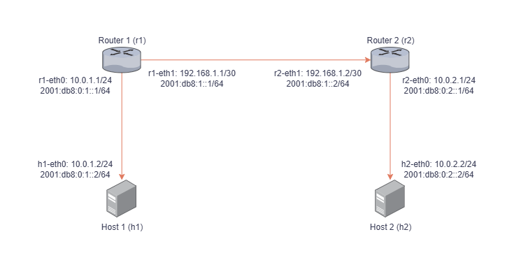

# Experimento de Análise de Desempenho

Este projeto realiza uma análise de desempenho de diferentes versões do TCP (como Reno, Cubic, BBR, Vegas, Veno e Westwood) em redes IPv4 e IPv6 utilizando uma topologia de rede emulada com Mininet. O objetivo é avaliar métricas de desempenho como **Throughput**, **RTT**, **Retransmissions**, **Packet Loss** e **CPU Usage**.

## Estrutura do Projeto

- **script.py**: Arquivo principal que implementa a topologia, realiza os testes e gera os gráficos.
- **start.sh**: Script de inicialização para instalar as dependências e executar o experimento.
- **dataset/**: Pasta onde os resultados dos testes serão salvos em formato CSV.
- **output/**: Pasta que contém a saída completa de todas as execuções do iperf.
- **graficos/**: Pasta com os gráficos gerados para as métricas analisadas, incluindo as médias e intervalos de confiança.

## Funcionalidades

1. **Instalação Automática**:
   - Ao executar o script `start.sh`, todas as dependências necessárias serão instaladas automaticamente.

2. **Topologia de Rede**:
   - O script Python cria uma topologia de rede com 2 roteadores e 2 hosts, configurados para IPv4 e IPv6.

   
   
3. **Entrada de Parâmetros**:
   - O usuário deve fornecer as seguintes configurações ao iniciar o script Python:
     - **Taxa de transferência (Gbps):** Taxa máxima de transmissão nos links.
     - **Atraso (ms):** Tempo de atraso dos links.
     - **Perda de Pacotes (%):** Porcentagem de perda de pacotes.
     - **Número de repetições:** Quantidade de vezes que os testes serão executados.

4. **Armazenamento de Resultados**:
   - **dataset/**: Resultados dos testes em formato CSV.
   - **output/**: Logs detalhados de todas as execuções do iperf.
   - **graficos/**: Gráficos das métricas de desempenho, organizados em subpastas.

5. **Visualização Web**:
   - Ao final da execução do script Python, os gráficos serão disponibilizados em uma página web acessível em:
     ```
     http://localhost:8080
     ```

## Como Usar

1. **Execute o Script de Inicialização**:
   ```bash
   ./start.sh
   ```
   Este comando:
   - Instalará as dependências necessárias (Python, Mininet, bibliotecas, etc.).
   - Iniciará o script Python automaticamente.

2. **Forneça os Parâmetros Solicitados**:
   - Durante a execução, insira os valores para as configurações de rede e testes quando solicitado pelo terminal.

3. **Acompanhe o Progresso**:
   - A execução do experimento criará os arquivos na pasta `dataset/` e logs na pasta `output/`.

4. **Visualize os Resultados**:
   - Os gráficos serão gerados e salvos na pasta `graficos/`.
   - Para acessar os gráficos pela web, abra o link:
     ```
     http://localhost:8080
     ```

## Métricas Analisadas

- **Throughput (Gbps)**: Taxa de transmissão de dados.
- **RTT (ms)**: Tempo de ida e volta dos pacotes.
- **Retransmissions**: Número de retransmissões de pacotes.
- **Packet Loss (%)**: Percentual de pacotes perdidos.
- **CPU Usage (%)**: Uso médio da CPU durante os testes.

## Requisitos

- **Python**: Versão 3.7 ou superior.
- **Iperf3**: Versão 3.16 ou superior.

---

**Observação:** Certifique-se de executar o script em um ambiente com permissões adequadas para o uso de redes emuladas.